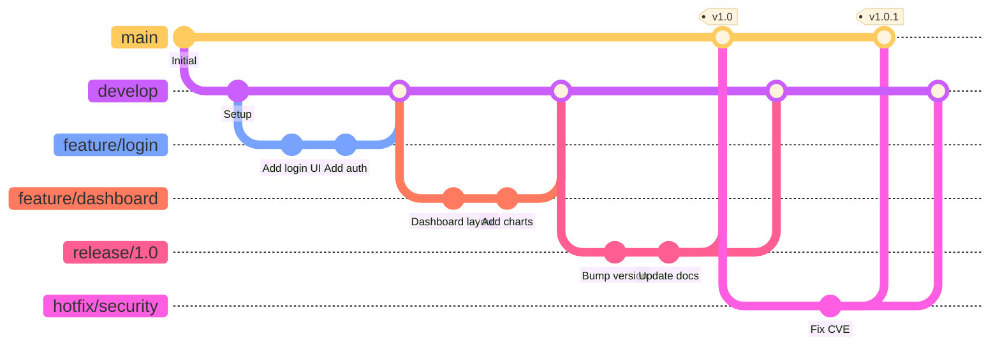
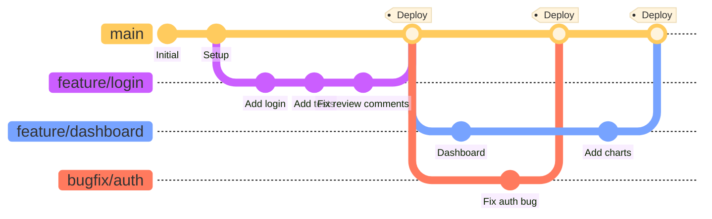
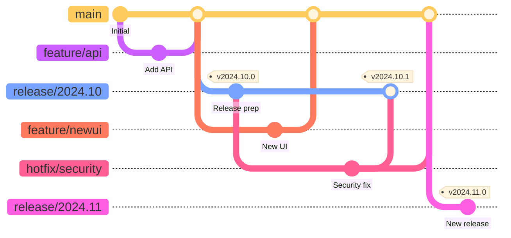
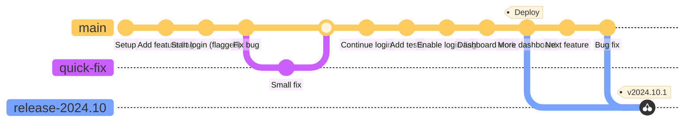

# Git Development Workflows

## Introduction

While Git provides the tools for version control, **how teams use Git** varies widely. Different workflows have emerged to address different team sizes, release schedules, and collaboration patterns. This notebook introduces four popular Git workflows and helps you understand when each might be appropriate for your projects.

Understanding these workflows is crucial for:
- **Collaborating effectively** with teams that may use different patterns
- **Choosing the right approach** for your project's needs
- **Avoiding common pitfalls** in team development
- **Scaling your development process** as projects grow

---

## 1. Git Flow

### Overview

Git Flow is a branching model designed around scheduled releases. It uses multiple long-lived branches and strictly defines roles for different branch types. Originally proposed by Vincent Driessen in 2010, it became popular for projects with planned release cycles.

### Branch Structure

| Branch Type | Purpose | Lifetime | Merged Into |
| :-- | :-- | :-- | :-- |
| **main** | Production-ready code | Permanent | - |
| **develop** | Integration branch for features | Permanent | main |
| **feature/** | New features | Temporary | develop |
| **release/** | Release preparation | Temporary | main & develop |
| **hotfix/** | Emergency production fixes | Temporary | main & develop |

### Common Tasks

| Task | Commands |
| :-- | :-- |
| Start new feature | `git checkout develop` `git checkout -b feature/my-feature` |
| Finish feature | `git checkout develop` `git merge feature/my-feature` `git branch -d feature/my-feature` |
| Start release | `git checkout develop` `git checkout -b release/1.0.0` |
| Finish release | `git checkout main` `git merge release/1.0.0` `git tag 1.0.0` `git checkout develop` `git merge release/1.0.0` |
| Hotfix | `git checkout main` `git checkout -b hotfix/critical-bug` `git checkout main` `git merge hotfix/critical-bug` `git checkout develop` `git merge hotfix/critical-bug` |

### Commit History Visualization

### Pros and Cons

**Pros:**
- Clear structure for scheduled releases
- Supports parallel development of multiple versions
- Well-documented and widely understood
- Good for maintaining multiple release versions

**Cons:**
- Complex with many branch types to manage
- Overhead can slow down small teams
- Not ideal for continuous deployment
- Merge conflicts can accumulate on long-lived branches

**Best For:** Traditional software with scheduled releases, desktop applications, libraries with semantic versioning

---

## 2. GitHub Flow

### Overview

GitHub Flow is a lightweight, branch-based workflow designed for continuous deployment. It emphasizes simplicity with a single long-lived branch and short-lived feature branches. Every merge to main triggers a deployment.

### Branch Structure

| Branch Type | Purpose | Lifetime | Merged Into |
| :-- | :-- | :-- | :-- |
| **main** | Production-ready, deployable code | Permanent | - |
| **feature/** | Any changes (features, fixes, experiments) | Temporary | main |

### Common Tasks

| Task | Commands |
| :-- | :-- |
| Start work | `git checkout main` `git pull origin main` `git checkout -b feature/my-work` |
| Continue work | `git add .` `git commit -m "Description"` `git push origin feature/my-work` |
| Submit for review | Create Pull Request on GitHub |
| Deploy | `git checkout main` `git merge feature/my-work` `git push origin main` (triggers deployment) |
| Hotfix | Same as any feature - create branch, PR, merge |

### Commit History Visualization

### Pros and Cons

**Pros:**
- Simple and easy to understand
- Fast iteration and continuous deployment
- Code review via Pull Requests
- Main branch always reflects production
- Minimal overhead

**Cons:**
- Requires good CI/CD infrastructure
- No support for multiple production versions
- Can be challenging for scheduled releases
- Requires discipline to keep main stable

**Best For:** Web applications, SaaS products, teams practicing continuous deployment, open-source projects

---

## 3. Microsoft Flow (Release Flow)

### Overview

Microsoft's Release Flow (also called OneFlow) is a simplified alternative to Git Flow that maintains the concept of release branches but reduces complexity. It's designed for products that need to support multiple versions in production while still enabling rapid development.

### Branch Structure

| Branch Type | Purpose | Lifetime | Merged Into |
| :-- | :-- | :-- | :-- |
| **main** | Latest development, future release | Permanent | - |
| **release/** | Stable releases (e.g., release/2024.10) | Long-lived | - |
| **feature/** | New features and changes | Temporary | main |
| **hotfix/** | Fixes for release branches | Temporary | release/* & main |

### Common Tasks

| Task | Commands |
| :-- | :-- |
| Start feature | `git checkout main` `git checkout -b feature/my-feature` |
| Finish feature | `git checkout main` `git merge feature/my-feature --no-ff` `git push origin main` |
| Create release | `git checkout main` `git checkout -b release/2024.10` `git push origin release/2024.10` |
| Hotfix release | `git checkout release/2024.10` `git checkout -b hotfix/critical` `git checkout release/2024.10` `git merge hotfix/critical` `git checkout main` `git merge hotfix/critical` |
| Cherry-pick to release | `git checkout release/2024.10` `git cherry-pick <commit-hash>` |

### Commit History Visualization

### Pros and Cons

**Pros:**
- Simpler than Git Flow but supports releases
- Clear separation between development and releases
- Supports multiple production versions
- Cherry-picking allows selective features in releases
- Scales well with large teams

**Cons:**
- More complex than GitHub Flow
- Cherry-picking can lead to drift between branches
- Requires discipline to keep branches synchronized
- Not ideal for continuous deployment

**Best For:** Enterprise software, products with scheduled releases, applications requiring long-term support versions

---

## 4. Trunk-Based Development

### Overview

Trunk-Based Development is a workflow where developers collaborate on code in a single branch called "trunk" (usually main), and avoid long-lived branches. Changes are integrated very frequently (multiple times per day), with feature flags used to hide incomplete features.

### Branch Structure

| Branch Type | Purpose | Lifetime | Merged Into |
| :-- | :-- | :-- | :-- |
| **main (trunk)** | All development happens here | Permanent | - |
| **short-lived branches** | Optional, 1-2 days max | < 2 days | main |
| **release branches** | (Optional) For release stabilization | Short | - |

### Common Tasks

| Task | Commands |
| :-- | :-- |
| Direct commit | `git checkout main` `git pull` `git add .` `git commit -m "Small change"` `git push` |
| Short-lived branch | `git checkout main` `git checkout -b fix-bug` `git commit -m "Fix"` `git push` (Create PR, merge within hours) |
| Feature flag | `if feature_flags.new_dashboard:` `    show_new_dashboard()` `else:` `    show_old_dashboard()` |
| Release | `git checkout main` `git checkout -b release-2024.10` `git tag v2024.10.0` |
| Hotfix | Commit directly to main, cherry-pick to release branch if needed |

### Commit History Visualization

### Pros and Cons

**Pros:**
- Minimizes merge conflicts
- Fast integration and feedback
- Encourages small, incremental changes
- Simplest possible branching model
- Supports continuous deployment
- Promotes collaboration and code sharing

**Cons:**
- Requires excellent CI/CD and testing
- Need feature flags infrastructure
- High discipline required from team
- Can feel risky without good tests
- Feature flags add code complexity

**Best For:** High-performing teams, continuous deployment environments, cloud-native applications, DevOps-mature organizations

---

## Comparison Summary

### Quick Reference Table

| Workflow | Complexity | Release Style | Branch Lifetime | Best Team Size | CI/CD Need |
| :-- | :-- | :-- | :-- | :-- | :-- |
| **Git Flow** | High | Scheduled | Long | Medium-Large | Moderate |
| **GitHub Flow** | Low | Continuous | Short | Any | High |
| **Microsoft Flow** | Medium | Scheduled | Medium-Long | Large | Moderate |
| **Trunk-Based** | Low | Continuous | Very Short/None | Any | Very High |

### Decision Guide

**Choose Git Flow if:**
- You have scheduled releases (quarterly, monthly)
- You maintain multiple versions in production
- You're working on desktop or mobile apps
- Your team is comfortable with complex branching

**Choose GitHub Flow if:**
- You deploy continuously to production
- You only maintain one production version
- You want simplicity and speed
- You have good automated testing

**Choose Microsoft Flow if:**
- You need scheduled releases but want less complexity than Git Flow
- You support multiple product versions
- You work in an enterprise environment
- You need selective feature releases

**Choose Trunk-Based Development if:**
- Your team practices DevOps/continuous deployment
- You have excellent CI/CD infrastructure
- You want maximum integration velocity
- Your team can commit to high discipline
- You can implement feature flags

---

## Practical Considerations

### Starting Points

Most teams benefit from starting simple:
1. **Start with GitHub Flow** - It's easy to learn and teaches good habits
2. **Add complexity only when needed** - If you need scheduled releases, consider Microsoft Flow
3. **Move toward Trunk-Based** as your CI/CD matures

### Hybrid Approaches

Many teams adapt these workflows to their needs:
- GitHub Flow + release branches for hotfixes
- Trunk-Based Development with very short feature branches for code review
- Microsoft Flow with more frequent releases

### Key Success Factors

Regardless of workflow chosen:
- **Clear team agreement** on the process
- **Automated testing** to catch issues early
- **Code review** practices (usually via Pull Requests)
- **Documentation** of your team's specific workflow
- **Regular retrospectives** to improve the process

---

## Further Reading

- [Git Flow Original Post](https://nvie.com/posts/a-successful-git-branching-model/) by Vincent Driessen
- [GitHub Flow Guide](https://docs.github.com/en/get-started/quickstart/github-flow)
- [Microsoft Release Flow](https://devblogs.microsoft.com/devops/release-flow-how-we-do-branching-on-the-vsts-team/)
- [Trunk-Based Development](https://trunkbaseddevelopment.com/)
- [Atlassian Git Workflow Comparison](https://www.atlassian.com/git/tutorials/comparing-workflows)
