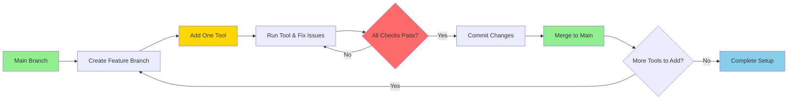
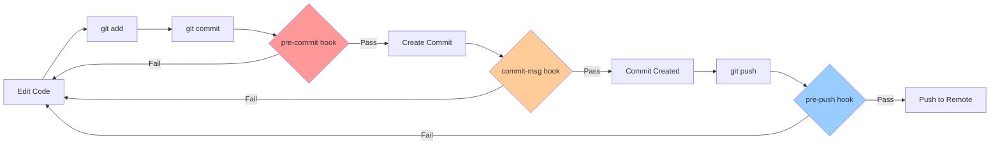

## Introduction

As a research software engineer, you're often working on small-to-medium projects with one or two collaborators. Code quality matters—not just for your own sanity when you revisit code months later, but also for building trust with collaborators and ensuring reproducible results. Yet setting up extensive CI/CD pipelines can feel like overkill for a project with two contributors.

This is where **automated static analysis integrated with Git** becomes invaluable. By catching issues *before* they enter your repository, you embrace a core principle of lean software development: **detect problems at the earliest, cheapest point possible**. Instead of discovering formatting inconsistencies during code review, or worse, debugging style-related issues weeks later, you catch them in seconds—right when you try to commit.

### Why This Matters for Small Projects

In small research teams, you need workflows that are:
- **Lightweight**: No complex infrastructure to maintain
- **Immediate**: Fast feedback loops that don't interrupt flow
- **Consistent**: Same standards applied automatically, every time
- **Educational**: Tools that help you write better code, not just police it

Git hooks with pre-commit checks deliver all of this. They work locally (no CI server needed), run in seconds, and gradually teach better coding practices through immediate feedback.

### Small-Batch Development in Action

The workflow we'll practice embodies small-batch development—making incremental changes that are tested and integrated frequently:



This iterative approach means:
- Each change is small and testable
- Problems are caught immediately, not after 10 changes
- You build confidence with each successful iteration
- Rollback is easy if something breaks

## What Are Git Hooks?

Git hooks are scripts that run automatically at specific points in your Git workflow. They live in the `.git/hooks/` directory of every Git repository. You can think of them as "event listeners" for Git operations.

### Common Hook Types

Git provides several hooks, but the most useful for code quality are:

- **pre-commit**: Runs before a commit is created (perfect for checking code style)
- **pre-push**: Runs before pushing to a remote (good for running tests)
- **commit-msg**: Runs after you write a commit message (useful for enforcing message conventions)



You can see what hooks are available by looking in your repository:

```bash
ls .git/hooks/
# You'll see sample files like pre-commit.sample, pre-push.sample, etc.
```

### The Challenge with Raw Git Hooks

While powerful, managing Git hooks manually has drawbacks:
- Hook scripts must be executable and written in shell/Python/Ruby/etc.
- They're not tracked in version control (`.git/` is not committed)
- Each team member must set them up independently
- No easy way to share hook configurations across projects
- Managing dependencies for hook scripts is cumbersome

This is where the **pre-commit framework** comes in.

## The Pre-Commit Framework

[Pre-commit](https://pre-commit.com/) is a framework that makes Git hooks easy to manage and share. Instead of writing hook scripts, you declare what checks you want in a configuration file (`.pre-commit-config.yaml`), and pre-commit handles the rest—including installing dependencies, managing virtual environments, and running the checks.

### Installation

```bash
pip install pre-commit
# or
conda install -c conda-forge pre-commit
```

### Key Commands

Here are the essential pre-commit commands you'll use:

| Command | Description |
|---------|-------------|
| `pre-commit install` | Install hooks into your Git repository (one-time setup) |
| `pre-commit run --all-files` | Run all hooks on all files (useful for initial setup) |
| `pre-commit run <hook-id>` | Run a specific hook (e.g., `pre-commit run black`) |
| `pre-commit run --files <file>` | Run hooks on specific files |
| `pre-commit autoupdate` | Update hook versions in your config file |
| `pre-commit uninstall` | Remove hooks from your repository |
| `pre-commit run --all-files --verbose` | Run all hooks with detailed output |

### How It Works

1. You create a `.pre-commit-config.yaml` file in your repository root
2. You run `pre-commit install` to set up the hooks
3. Every time you `git commit`, pre-commit automatically runs your configured checks
4. If any check fails, the commit is blocked until you fix the issues
5. Many hooks auto-fix issues (like formatting), so you just `git add` the fixes and commit again

### Configuration File Structure

The `.pre-commit-config.yaml` file defines which hooks to run. Here's the basic structure:

```yaml
# .pre-commit-config.yaml
repos:
  - repo: https://github.com/pre-commit/pre-commit-hooks
    rev: v4.4.0  # Version/tag to use
    hooks:
      - id: trailing-whitespace  # Hook identifier
      - id: end-of-file-fixer

  - repo: https://github.com/psf/black
    rev: 24.4.2
    hooks:
      - id: black
        language_version: python3  # Optional: specify Python version
```

Each repository can provide multiple hooks. You specify which ones you want by their `id`.

## Quick Win: Your First Pre-Commit Hook

Let's see immediate value with a minimal example. Create a `.pre-commit-config.yaml` file:

```yaml
repos:
  - repo: https://github.com/pre-commit/pre-commit-hooks
    rev: v4.4.0
    hooks:
      - id: trailing-whitespace
      - id: end-of-file-fixer
```

Then install and test:

```bash
# Install the hooks
pre-commit install

# Run on all files to see what needs fixing
pre-commit run --all-files

# You'll see output like:
# Trim Trailing Whitespace............................Failed
# Fix End of Files....................................Failed
```

Pre-commit will automatically fix these issues! Just stage the changes and commit:

```bash
git add -u
git commit -m "Set up pre-commit hooks"
# This time the hooks pass and the commit succeeds
```

**You've just automated two quality checks with ~10 lines of YAML.** Now these checks run on every commit, catching issues before they enter your history.

## Pre-commit Hook Reference

| Hook | Description |
|------|-------------|
| [`trailing-whitespace`](https://github.com/pre-commit/pre-commit-hooks) | Removes trailing whitespace from the end of lines in files. |
| [`end-of-file-fixer`](https://github.com/pre-commit/pre-commit-hooks) | Ensures files end with a newline character. |
| [`check-json`](https://github.com/pre-commit/pre-commit-hooks) | Validates JSON files for syntax errors. |
| [`check-yaml`](https://github.com/pre-commit/pre-commit-hooks) | Validates YAML files for syntax errors. |
| [`check-toml`](https://github.com/pre-commit/pre-commit-hooks) | Validates TOML files for syntax errors. |
| [`check-added-large-files`](https://github.com/pre-commit/pre-commit-hooks) | Prevents committing files larger than a specified size threshold. |
| [`black`](https://github.com/psf/black) | Automatically formats Python code to conform to the Black style guide. |
| [`isort`](https://github.com/pycqa/isort) | Sorts and organizes Python import statements. |
| [`flake8`](https://github.com/pycqa/flake8) | Checks Python code for style violations and common errors. |
| [`ruff`](https://github.com/astral-sh/ruff-pre-commit) | Fast Rust-based linter that replaces flake8, isort, and other Python tools. |
| [`ruff-format`](https://github.com/astral-sh/ruff-pre-commit) | Fast Rust-based formatter that serves as a drop-in replacement for Black. |
| [`nbqa-black`](https://github.com/nbQA-dev/nbQA) | Runs Black formatter on Python code cells within Jupyter notebooks. |
| [`nbqa-isort`](https://github.com/nbQA-dev/nbQA) | Runs isort on import statements in Jupyter notebook code cells. |
| [`nbqa-ruff`](https://github.com/nbQA-dev/nbQA) | Runs ruff linter on Python code cells within Jupyter notebooks. |
| [`nbstripout`](https://github.com/kynan/nbstripout) | Strips output cells from Jupyter notebooks before committing. |

## Hands-On Exercise: Building a Complete Pre-Commit Setup

**Time estimate: 40 minutes**

### Learning Objectives

By the end of this exercise, you will:
- Understand how to add multiple static analysis tools to a repository
- Practice an iterative, branch-based workflow for adding quality checks
- Experience the immediate feedback loop of automated code quality tools
- Build confidence configuring tools for Python projects (including Jupyter notebooks)

### Why This Workflow?

You'll add checks **one at a time** using feature branches. This mirrors real-world practice where you:
1. Don't overwhelm your codebase (or yourself) with 10 new checks at once
2. Can verify each tool works correctly before moving on
3. Get clean, focused commits that are easy to review and understand
4. Learn to fix issues specific to each tool without confusion

### Instructions

1. **Fork and clone** the repository at <url will be put here later>.

2. **Install pre-commit** if you haven't already:
   ```bash
   pip install pre-commit
   ```

3. **Repeat the following procedure for 5 different checker tools** (choose from the reference table below):

   a. **Choose a tool** you'd like to add (start with auto-fixers like `black` or `trailing-whitespace` for quick wins)

   b. **Create a feature branch**:
      ```bash
      git checkout -b feature-<tool-name>
      ```

   c. **Add the tool** to `.pre-commit-config.yaml` in the root directory (see reference table below for configuration)

   d. **Run the specific tool** and fix issues until it passes:
      ```bash
      pre-commit run <hook-id> --all-files --verbose
      ```

   e. **Run all checks** to ensure nothing broke:
      ```bash
      pre-commit run --all-files
      ```

   f. **Install/update hooks** (if first time, or to refresh):
      ```bash
      pre-commit install
      ```

   g. **Commit your changes** (the hooks run automatically):
      ```bash
      git add .
      git commit -m "Add <tool-name> pre-commit hook"
      ```

   h. **Merge to main** and clean up:
      ```bash
      git checkout main
      git merge feature-<tool-name>
      git branch -d feature-<tool-name>
      ```

   i. **Push to GitHub**:
      ```bash
      git push origin main
      ```

4. **Repeat** for 4 more tools. By the end, you'll have a robust, automated quality checking system!

## Troubleshooting Tips

### Hook Failed, Now What?

When a hook fails, pre-commit gives you detailed output. Here's how to interpret and fix common issues:

**Auto-fixing tools (black, isort, trailing-whitespace)**
```bash
# Hook fails and modifies files automatically
# Solution: Just add the changes and commit again
git add -u
git commit -m "Your message"  # Now it passes!
```

**Linting tools (flake8, ruff)**
```bash
# Hook fails with error messages but doesn't fix them
# Solution: Read the errors, fix manually, then commit
# Example: "line too long" -> break the line
# Example: "unused import" -> remove the import
```

### Common Issues

**"Hook not found" or "command not found"**
- Run `pre-commit install` to set up hooks after cloning
- Run `pre-commit clean` then `pre-commit install --install-hooks` to force reinstall

**Hooks are really slow**
- First run is slow (installing tools), subsequent runs are fast
- Use `--files` flag to run on specific files during testing

**Conflicting formatters (black vs. isort)**
- Configure isort to be compatible with black in `pyproject.toml`:
  ```toml
  [tool.isort]
  profile = "black"
  ```

**Need to skip hooks temporarily**
```bash
# Emergency bypass (use sparingly!)
git commit --no-verify -m "Message"
```

### Best Practices for Small Teams

1. **Start with auto-fixers**: Add `black`, `isort`, `trailing-whitespace` first—they fix issues automatically
2. **Add linters gradually**: Introduce `flake8` or `ruff` after formatters are working
3. **Run on existing code first**: Use `pre-commit run --all-files` before enabling to see scope of changes
4. **Document team decisions**: Add a comment in `.pre-commit-config.yaml` explaining why you chose specific tools
5. **Update regularly**: Run `pre-commit autoupdate` monthly to get bug fixes and improvements

## Further Reading & References

### Official Documentation

- **[Pre-commit Framework](https://pre-commit.com/)** - Official docs with comprehensive hook catalog
- **[Pre-commit Hooks Repository](https://github.com/pre-commit/pre-commit-hooks)** - Standard hooks maintained by the pre-commit team
- **[Git Hooks Documentation](https://git-scm.com/docs/githooks)** - Git's official documentation on hooks

### Python Tools

- **[Black](https://black.readthedocs.io/)** - The uncompromising Python code formatter
- **[Ruff](https://docs.astral.sh/ruff/)** - Fast Rust-based linter and formatter for Python
- **[isort](https://pycqa.github.io/isort/)** - Python import statement organizer
- **[flake8](https://flake8.pycqa.org/)** - Python style guide enforcement
- **[nbQA](https://nbqa.readthedocs.io/)** - Adapter for running code quality tools on Jupyter notebooks

### Continuous Integration & Research Software Engineering

- **[The Turing Way: Continuous Integration](https://the-turing-way.netlify.app/reproducible-research/ci.html)** - Best practices for CI in research
- **[Good Enough Practices in Scientific Computing](https://journals.plos.org/ploscompbiol/article?id=10.1371/journal.pcbi.1005510)** - Practical recommendations for research software
- **[Research Software Engineering with Python](https://merely-useful.tech/py-rse/)** - Comprehensive guide to professional practices

### Lean & Small-Batch Development

- **[Continuous Delivery](https://continuousdelivery.com/)** - Core principles of small-batch, continuous integration
- **[The DevOps Handbook](https://itrevolution.com/product/the-devops-handbook/)** - Chapter on continuous integration and trunk-based development

### Advanced Topics

- **[Pre-commit CI](https://pre-commit.ci/)** - Automated service to run pre-commit hooks in GitHub Actions
- **[Conventional Commits](https://www.conventionalcommits.org/)** - Standardized commit message format (can be enforced via hooks)
- **[Trunk-Based Development](https://trunkbaseddevelopment.com/)** - Development model that pairs well with pre-commit hooks
